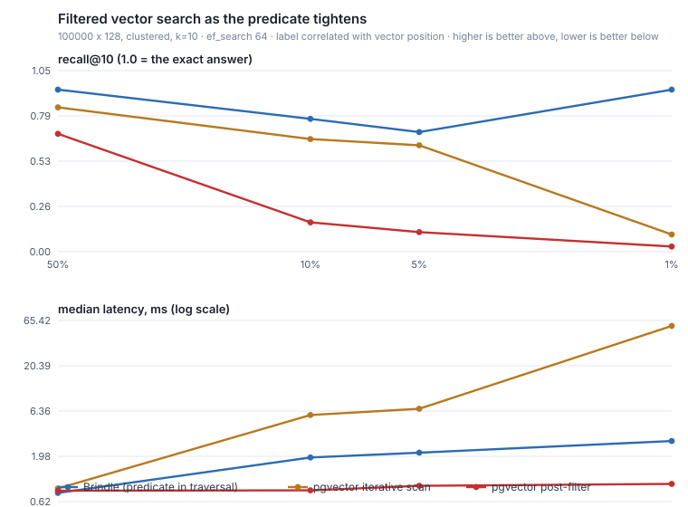

# Brindle

**Filter-aware, hybrid vector search for PostgreSQL — written in Rust & fully vibe-coded from scratch.**

[](https://github.com/adriendinzey/Brindle/actions/workflows/ci.yml)
[](https://www.postgresql.org/)
[](LICENSE)

Brindle is a PostgreSQL extension for approximate nearest-neighbor (ANN) vector
search whose design goal is the query production RAG and search systems actually
issue:

```sql
-- "Find the 10 most semantically similar products under $50 for this tenant"
SELECT id, name
FROM products
WHERE tenant_id = 42 AND price < 50      -- structured predicate
ORDER BY embedding <-> $1                 -- vector similarity
LIMIT 10;
```

Plain HNSW indexes degrade badly on queries like this: filtering *after* the
graph search throws away most of the candidates the index worked to find, while
filtering *before* it means the index isn't used at all. Brindle pushes the
predicate **into** the graph traversal, so the search budget is spent on rows
that can actually be answers and recall stays high under selective filters.

> **Status: working, and not production-ready.** A learning-grade project built
> in the open. Vector search and filtered vector search work end to end from
> SQL; durable paged storage, hybrid ranking at the SQL level, and quantization
> do not exist yet. [docs/ROADMAP.md](docs/ROADMAP.md) tracks what is built,
> [docs/BENCHMARKS.md](docs/BENCHMARKS.md) has the measured numbers, and the
> honest caveats are in **[Where it stands](#where-it-stands)** below.

> ⚠️ **On Windows, build inside WSL2 on the Linux-native filesystem.** Clone to
> `~/code/brindle` (ext4) and develop there — not under `/mnt/c` or `/mnt/d`.
> `cargo`/`rustc` touch thousands of small files, and Windows drives are reached
> from WSL over the slow 9P protocol, so builds on `/mnt/*` are commonly 5–10×
> slower than on the native filesystem. Full setup:
> [docs/DEVELOPMENT.md](docs/DEVELOPMENT.md).

## Why another Postgres vector extension?

The space is mature — [pgvector](https://github.com/pgvector/pgvector),
[pgvectorscale](https://github.com/timescale/pgvectorscale), and
[VectorChord](https://github.com/tensorchord/VectorChord) are all excellent.
Brindle deliberately does **not** compete on raw QPS or quantization. It targets
the one thing they all still handle awkwardly: **arbitrary metadata filtering
combined with vector search**, plus hybrid lexical+semantic ranking in a single
index. See [docs/ARCHITECTURE.md](docs/ARCHITECTURE.md) for the full rationale and
competitive analysis.

## Design pillars

1. **Filter-aware traversal** — an [ACORN](https://arxiv.org/abs/2403.04871)-style
   HNSW that keeps the matching-node subgraph navigable under predicates.
   ([docs/FILTERING.md](docs/FILTERING.md))
2. **Hybrid ranking** — vector + PostgreSQL full-text, fused with Reciprocal
   Rank Fusion. *The fusion core is implemented and tested; the SQL surface
   (`brindle_hybrid()`) is not built yet.*
3. **Honest engineering** — `Result`-based error handling, no `unwrap()` in hot
   paths, zero-allocation distance kernels, benchmark-driven claims.
4. **Drop-in friendly** — its own `brindle_vector` type speaks pgvector's text
   format and operators (`<->`, `<=>`, `<#>`), and `real[]` columns index
   directly, so moving over is low-friction and pulls in no other extension.

## Quick start (dev)

Brindle is built with [`pgrx`](https://github.com/pgcentralfoundation/pgrx).
Building is best done on Linux / WSL2 / macOS (not native Windows).

```bash
# one-time toolchain setup
cargo install --locked cargo-pgrx
cargo pgrx init                      # downloads & builds dev Postgres versions

# from the repo root
cargo pgrx run pg17                  # builds + drops you into psql with brindle loaded
```

Then, in the `psql` session it opens:

```sql
CREATE EXTENSION brindle;

CREATE TABLE products (
    id        bigserial PRIMARY KEY,
    tenant_id int,
    price     float8,
    embedding real[]
);

INSERT INTO products (tenant_id, price, embedding)
SELECT i % 10, (i % 100)::float8, ARRAY[(i % 500)::real, (i / 500)::real]
FROM generate_series(1, 5000) i;

-- The filterable columns are KEY columns after the vector, not INCLUDE columns.
-- That distinction is the whole mechanism: PostgreSQL only matches a WHERE
-- clause to an index column that is part of the search key, so a qual on an
-- INCLUDE column never reaches the index and gets applied afterwards -- which is
-- the post-filtering this design exists to avoid.
CREATE INDEX products_embedding_idx
    ON products USING brindle (embedding, tenant_id, price);

SELECT id, price
FROM products
WHERE tenant_id = 7 AND price < 50
ORDER BY embedding <-> ARRAY[250, 10]::real[]
LIMIT 10;
```

`EXPLAIN` on that query should show `Index Scan using products_embedding_idx`
with an `Index Cond` — the predicate reaching the traversal. If it shows a
`Filter` instead, the qual is being applied after the search rather than during
it. (On a table this small PostgreSQL may prefer a sequential scan, which is the
right call; `SET enable_seqscan = off` to see the index plan.)

Filterable columns must have a brindle operator class, which ships for `bool`,
`int2`, `int4`, `int8`, `float4` and `float8`. Text labels and timestamps are
refused at `CREATE INDEX` rather than silently ignored — see
[docs/FILTERING.md](docs/FILTERING.md) § 3 for the supported predicate shapes.

Full setup notes (toolchain, the WSL2 native-filesystem loop, and parallel
development) live in [docs/DEVELOPMENT.md](docs/DEVELOPMENT.md).

## Does it actually work?

The design targets recall under a filter that correlates with the embedding — a
category that tracks content, a price band that tracks product type, a tenant
that tracks topic. On 100 000 rows × 128 dimensions at the default `ef_search`,
same rows and same ground truth on every side:



| rows matching the filter | Brindle | pgvector iterative scan | pgvector post-filter |
|---|---|---|---|
| 50% | **0.940** / 0.79 ms | 0.833 / 0.90 ms | 0.697 / 0.76 ms |
| 10% | **0.770** / 2.05 ms | 0.657 / 5.52 ms | 0.170 / 0.83 ms |
| 5% | **0.693** / 2.28 ms | 0.633 / 5.78 ms | 0.113 / 0.92 ms |
| 1% | **0.940** / 3.20 ms | 0.093 / 61.3 ms | 0.030 / 0.95 ms |

*recall@10 / median latency.* At 1% selectivity Brindle answers at 0.940 recall
in 3.2 ms where pgvector's iterative scan reaches 0.093 in 61 ms. Give pgvector
its best configuration — both scan-budget settings opened up — and it reaches
0.780 at about 160 ms, still behind on recall and roughly 50× slower.

**Where it does not win.** With an *uncorrelated* filter — matching rows
sprinkled through every neighbourhood — iterative scan is excellent, and at 1%
selectivity it beats Brindle 0.967 to 0.893 at the default `ef_search`. It
should: with matches everywhere there is nothing for predicate-aware traversal to
be clever about. Post-filtering is also faster than everything, everywhere; it is
simply answering a different, wrong question at 0.030 recall. And pgvector's
build is randomised, so its column moves between builds while Brindle's does not.

The method, the full sweep at two `ef_search` points, the build-to-build range,
and the caveats are in [docs/BENCHMARKS.md](docs/BENCHMARKS.md), regenerated by
one command.

## Where it stands

Measured on 100 000 rows × 128 dimensions, clustered, against pgvector 0.8.0 on
the same rows, queries and ground truth at matched `m`/`ef_construction`
([docs/BENCHMARKS.md](docs/BENCHMARKS.md) has the method and the caveats):

| `ef_search` = 64 | Brindle | pgvector |
|---|---|---|
| query latency p50 | **0.34 ms** warm · **57.9 ms** cold | 0.60 ms |
| recall@10 | 0.966 | 0.978 |
| index size | 77 MB | 79 MB |
| build (single-threaded both sides) | 106 s | 39 s |

**Read the warm and cold figures together.** A backend decodes the whole index
into memory on its first scan and answers later queries from that copy, so
long-lived connections see the warm number and a freshly connected one pays the
cold. pgvector has no such split — it works out of the shared buffer cache,
warmed once for the whole server, which is why it has a single number here.

That is also the asymmetry behind the warm win: Brindle is faster there partly
by holding a private ~89 MB copy of the index **per backend**, memory pgvector
does not spend. Paged storage ([docs/STORAGE.md](docs/STORAGE.md)) is what
removes both the cold cost and the per-backend copy; it is designed and not yet
built.

### What works

- `CREATE INDEX ... USING brindle` over `real[]` or `brindle_vector`, with L2,
  cosine and inner-product operator classes.
- Filtered search: a `WHERE` clause on an indexed attribute column is pushed
  into the graph traversal (equality and ranges on the numeric types above,
  combined with `AND`). A qual the index cannot express is rechecked by the
  executor rather than dropped.
- Incremental `INSERT`, `VACUUM` integration, and `ef_search` / `m` /
  `ef_construction` / `gamma` as a GUC and index options.
- Writes are WAL-logged, so the index survives a crash and reaches replicas.

### What does not

- **Storage is an interim whole-index blob**, not paged. Every write rewrites and
  re-logs the whole image, so WAL volume is O(index) per write-back, and the
  cold-path latency above is the same limitation seen from the read side.
- **No hybrid SQL surface yet** — the RRF core is implemented and tested, but
  `brindle_hybrid()` is not built.
- **No quantization**, so vectors are stored at full `float4` width.
- Recall is a property of the dataset as much as the index: on a *uniform*
  128-dimensional fixture, recall@10 is 0.375 at `ef_search = 64` — and pgvector
  scores the same on the same data, because distances concentrate and a greedy
  graph walk has no gradient to follow. `docs/BENCHMARKS.md` measures this
  directly rather than quietly picking a friendlier fixture.

## Development

Setup and build: [docs/DEVELOPMENT.md](docs/DEVELOPMENT.md). Design and
rationale: [docs/ARCHITECTURE.md](docs/ARCHITECTURE.md) and
[docs/FILTERING.md](docs/FILTERING.md). Code conventions:
[docs/CODING_STANDARDS.md](docs/CODING_STANDARDS.md).

## License

PostgreSQL License (matches the pgvector ecosystem). See `LICENSE`.
